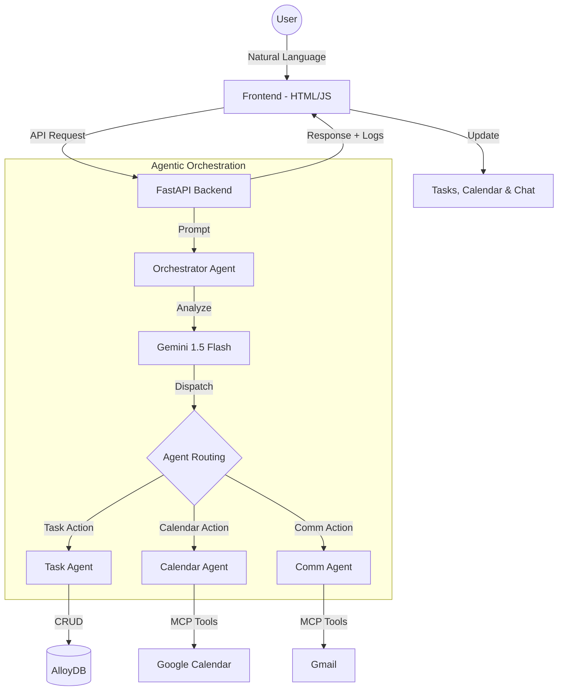
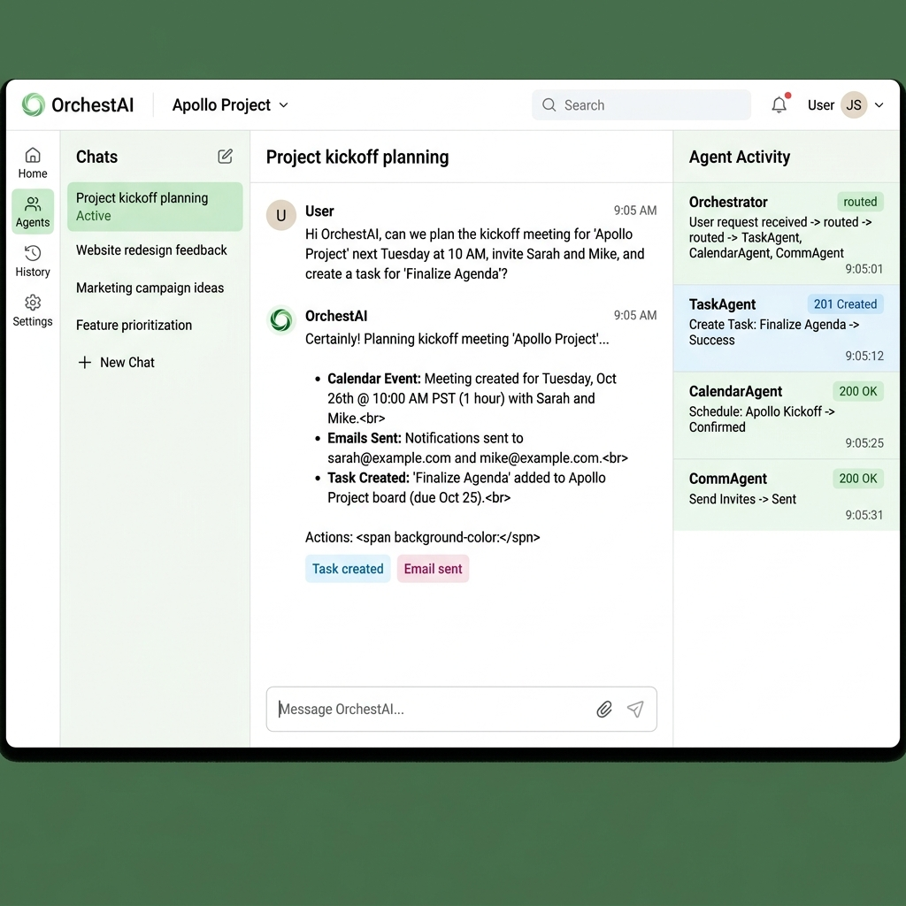
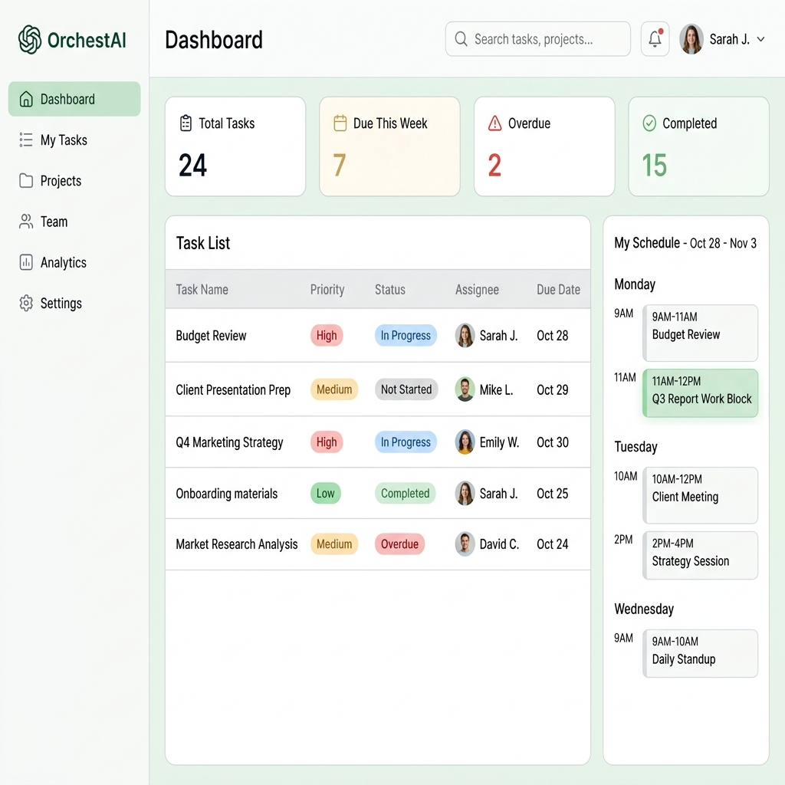

# OrchestAI 🚀

OrchestAI is an intelligent, agent-driven orchestration platform designed to streamline your productivity. By combining the power of **Google Gemini 1.5 Flash** with **AlloyDB**, OrchestAI acts as a central hub for managing your tasks, calendar events, and communications through a simple yet powerful chat interface.

## ✨ Key Features

- **🤖 Intelligent Orchestrator**: A multi-agent system that understands complex natural language requests and routes them to specialized agents.
- **📋 Task Management**: Create, update, and track tasks with automated priority and status management, persisted in Google AlloyDB.
- **📅 Calendar Integration**: Seamlessly schedule and manage meetings through Google Calendar via MCP (Model Context Protocol) tools.
- **📧 Communication Hub**: Send emails and manage communications directly from the chat interface using Gmail integration.
- **📊 System Logs**: Detailed execution logs for monitoring agent activities and status.
- **🔐 Secure Auth**: Built-in Google OAuth2 authentication for secure access to your workspace.

## 🏗️ Architecture

OrchestAI is built with a modern, scalable stack:

- **Frontend**: Vanilla HTML5, CSS3, and JavaScript for a fast, responsive user experience without heavy framework overhead.
- **Backend**: FastAPI (Python) providing a robust and high-performance asynchronous API.
- **AI Engine**: Google Gemini 1.5 Flash for natural language understanding and agentic reasoning.
- **Database**: Google Cloud AlloyDB for PostgreSQL, providing enterprise-grade performance and scalability.
- **Integrations**: Google Workspace APIs (Calendar, Gmail) via the Model Context Protocol (MCP).

### System Flow

The following diagram illustrates how OrchestAI processes user requests:



## 📸 Screenshots

| Chat Interface | Task Management |
| :---: | :---: |
|  |  |

## 🚀 Getting Started

### Prerequisites

- Python 3.10 or higher
- A Google Cloud Project with the following enabled:
    - Generative AI API (Gemini)
    - Google Calendar API
    - Gmail API
- An AlloyDB instance (or a local PostgreSQL instance for development)

### Installation

1. **Clone the repository**:
   ```bash
   git clone https://github.com/your-username/orchestai.git
   cd orchestai
   ```

2. **Set up a virtual environment**:
   ```bash
   python -m venv venv
   source venv/bin/activate  # On Windows use `venv\Scripts\activate`
   ```

3. **Install dependencies**:
   ```bash
   pip install -r requirements.txt
   ```

4. **Configure environment variables**:
   Create a `.env` file in the root directory:
   ```env
   GOOGLE_API_KEY=your_gemini_api_key
   DB_USER=your_db_user
   DB_PASS=your_db_password
   DB_NAME=orchestai
   DB_HOST=127.0.0.1
   GOOGLE_CLIENT_ID=your_google_oauth_client_id
   GOOGLE_CLIENT_SECRET=your_google_oauth_client_secret
   ```

5. **Initialize the database**:
   ```bash
   python db/init_db.py
   ```

6. **Run the application**:
   ```bash
   python main.py
   # OR
   uvicorn main:app --reload
   ```

---
*Built with ❤️ by the OrchestAI Team.*
